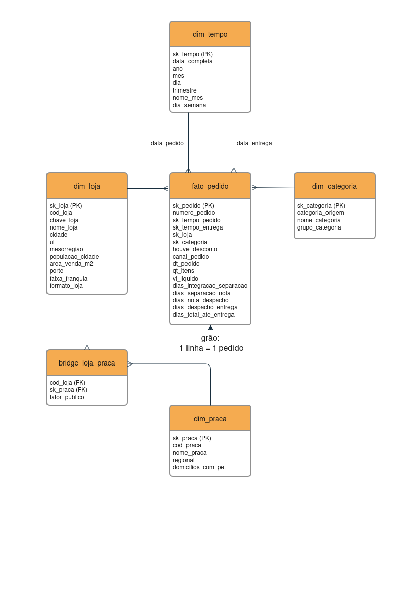

# 🐾 Pata Amiga — Data Warehouse

|                         |                                          |
| ----------------------- | ---------------------------------------- |
| **Autor**         | Rodrigo Maduell Fonseca                  |
| **Turma**         | Análise de Dados com Python - T2 - 2026 |
| **Instituição** | SCTEC/SENAI-SC                           |
| **Projeto**       | Mini-Projeto Avaliativo — Módulo 2     |

---

## 📋 Descrição do Case

A Pata Amiga é uma rede catarinense de pet shops com 32 lojas espalhadas pelo estado.
Em setembro de 2023 a rede integrou seus canais de venda — app, site, telefone, WhatsApp
e loja física — e em sete meses acumulou 4.044 pedidos.

A diretoria quer usar esses sete meses para responder cinco perguntas estratégicas:
onde está o gargalo da entrega, qual categoria sustenta o faturamento, se a política
de desconto funciona igual em todo canal, onde concentra o faturamento por praça e
onde abrir a próxima loja.

---

## 🔍 Diagnóstico da Origem

Antes de qualquer tratamento, as três tabelas de staging foram inspecionadas.
Os números abaixo orientaram todas as decisões de limpeza.

| Item                                      | Resultado                           |
| ----------------------------------------- | ----------------------------------- |
| Grafias distintas de nome de loja         | 50 grafias para 32 lojas            |
| Grafias distintas de categoria de produto | 18 grafias para 7 categorias        |
| Pedidos sem Código de Loja               | 1.575 (~39% do total)               |
| Pedidos sem Nome de Loja                  | 3 pedidos                           |
| Grafias distintas de HouveDesconto        | 12 grafias para 3 valores           |
| Grafias distintas de CanalPedido          | 8 grafias para 6 canais             |
| Grafias distintas de FormaPagamento       | 9 grafias                           |
| Marcos em branco — Separação           | 1.077 pedidos                       |
| Marcos em branco — Nota Fiscal           | 1.338 pedidos                       |
| Marcos em branco — Despacho              | 1.665 pedidos                       |
| Marcos em branco — Entrega               | 1.953 pedidos (processos em aberto) |

---

## ⭐ Modelo Dimensional

O modelo dimensional foi estruturado em esquema estrela, tendo `fato_pedido`
como tabela central, com granularidade de uma linha por pedido.

